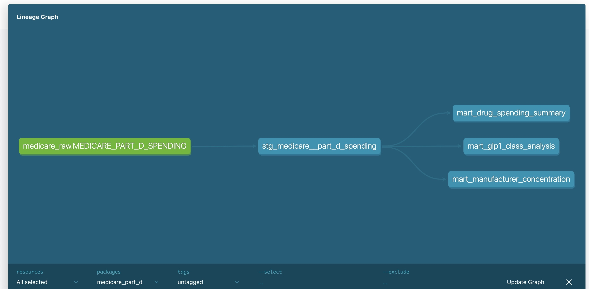

# Medicare Part D Drug Spending Analytics — dbt + Snowflake

## Overview
An analytics engineering project modeling Medicare Part D quarterly drug spending data from CMS (Centers for Medicare & Medicaid Services). Built with dbt Core and Snowflake following the three-layer architecture: sources → staging → marts.

## Business Questions Answered
- Which drugs drive the most Medicare Part D spending?
- How is the GLP-1 class (Ozempic, Mounjaro, Wegovy, Zepbound) growing year over year?
- Which manufacturers control the largest share of Part D spend?

## Project Architecture

## Models

### Staging
| Model | Description |
|---|---|
| `stg_medicare__part_d_spending` | Cleans raw CMS data — strips currency formatting, casts to numeric types, standardizes column names |

### Marts
| Model | Description |
|---|---|
| `mart_drug_spending_summary` | One row per drug per reporting period with total spend, claims, and beneficiaries |
| `mart_glp1_class_analysis` | GLP-1 drugs tagged by molecule family (Semaglutide, Tirzepatide, Dulaglutide, Liraglutide, Exenatide) with spend and growth metrics |
| `mart_manufacturer_concentration` | Manufacturer-level spend aggregated by period with market share percentage |

## Data Quality
13 dbt tests across all models covering:
- `not_null` on all key columns
- `accepted_values` on reporting period

## Tech Stack
- **dbt Core** 1.11.3
- **Snowflake** (trial account)
- **Source data:** CMS Medicare Quarterly Part D Spending by Drug (Q3 2025 release)

## Key Findings
- Ozempic ($13B) and Mounjaro ($6.3B) are the 2nd and 4th largest Part D drug spends in 2024
- Zepbound grew from $387K (full year 2024) to $572M (Q1–Q3 2025)
- Wegovy nearly tripled from $301M (2024) to $696M (Q1–Q3 2025 only)
- Novo Nordisk is the #2 manufacturer by total Part D spend at $18.6B in 2024
